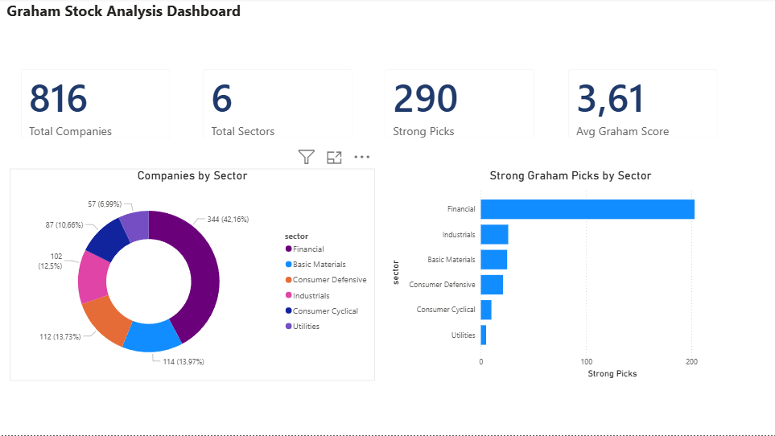
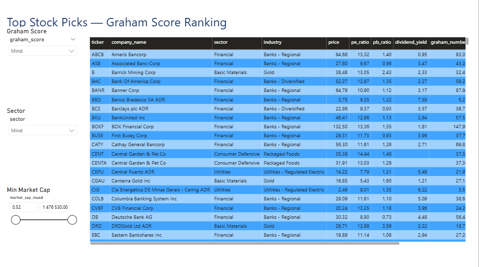

# Graham Stocks Pipeline

> Automatizált napi ETL pipeline, amely Finvizről húzza le a részvény-fundamentumokat, alkalmazza Benjamin Graham *Defensive Investor* szempontjait **szektor-érzékeny finomításokkal**, és MySQL + Power BI rétegeken keresztül szolgáltatja az eredményt.

📖 *[English version / Angol verzió](README.md)*

---

## A projekt célja

Ez a projekt egy **production-grade analitikai pipeline-t** demonstrál fundamentális részvényelemzéshez. Portfólió-darabként készült egy karrier-átmenet során — prémium bankár (8 év) szerepből Business Analyst pozíció felé. Bemutatja a **teljes adat-product kompetenciát**: adatmérnöki munka, módszertan-tervezés, observability, és üzleti intelligencia szállítás.

A rendszer Benjamin Graham *Defensive Investor* keretrendszerét implementálja egy fontos finomítással: a kritériumok **szektor-érzékenyen** alkalmazódnak, mert az eredeti módszertan ipari cégekre készült, és félrevezető eredményt ad bankok, bányász- és autóipari cégek esetén.

---

## Architektúra

```
┌─────────────────────────────────────────────────────────────┐
│                       Finviz (web)                          │
└──────────────────────────┬──────────────────────────────────┘
                           │ scrape (finvizfinance lib)
                           ▼
┌─────────────────────────────────────────────────────────────┐
│            Python ETL Pipeline (scraper.py)                 │
│  - Overview + Valuation + Financial nézetek lehúzása       │
│  - Adattisztítás és transzformáció (% parsing, stb.)       │
│  - Graham Number, Price/Graham, Graham Score számítás       │
│  - Szektor-érzékeny scoring logika                          │
└──────────────────────────┬──────────────────────────────────┘
                           │
        ┌──────────────────┼──────────────────┐
        ▼                  ▼                  ▼
  ┌─────────────┐  ┌─────────────────┐  ┌───────────┐
  │   stock_    │  │     stock_      │  │  etl_log  │
  │  fundament  │  │   fundamentals_ │  │  (audit)  │
  │     als     │  │      history    │  │           │
  │ (snapshot)  │  │  (idősoros)     │  │           │
  └──────┬──────┘  └────────┬────────┘  └─────┬─────┘
         │           7 SQL view               │
         └──────────────────┼─────────────────┘
                            ▼
                  ┌──────────────────┐         ┌──────────────────┐
                  │  Power BI        │ ◄────── │  Windows Task    │
                  │  Dashboard       │         │  Scheduler       │
                  │  (2 oldal)       │         │  (napi 22:00)    │
                  └──────────────────┘         └──────────────────┘
```

### Tech stack

- **MySQL 8.0** — Adat-tárház a `localhost:3307`-on
- **Python 3.12** — ETL: `pandas`, `SQLAlchemy`, `finvizfinance`, `python-dotenv`
- **Windows Task Scheduler** — Napi automata futás `run_scraper.bat`-en keresztül
- **Power BI Desktop** — Vizualizációs réteg (2 oldalas interaktív dashboard)

---

## Módszertan: Graham szempontok szektor-érzékeny finomításokkal

A rendszer minden részvényt **0-7 közötti pontszámmal** értékel:

| # | Kritérium | Általános szabály | Bank-specifikus eltérés |
|---|---|---|---|
| 1 | Mérsékelt P/E | P/E < 15 | ugyanaz |
| 2 | Mérsékelt P/B | P/B < 1.5 | ugyanaz |
| 3 | Pozitív profit | EPS > 0 | ugyanaz |
| 4 | Osztalékot fizet | Dividend yield > 0 | ugyanaz |
| 5 | Megfelelő méret | Market cap > $2B | ugyanaz |
| 6 | Likviditás | Current Ratio > 2 | **ROE > 8%** |
| 7 | Alacsony adósság | LT Debt / Eq < 1 | **EPS növekedés (5év) > 0** |

**Miért szükséges a szektor-érzékenység?** Graham maga is **kizárta a pénzintézeteket** a klasszikus szempontjaiból, mert a banki mérleg alapvetően másképp működik — ami egy ipari cégnél „kötelezettség", az a banknál az alaptevékenység. A bányász- és autóipari cégek viszont erősen ciklikusak, ami torzítja a trailing earnings-et. A módszertan egyenletes alkalmazása félrevezető eredményt ad.

### Számolt mutatók

| Mutató | Képlet | Értelmezés |
|---|---|---|
| **Graham Number** | √(22.5 × EPS × BVPS) | Belső érték durva becslése; a maximális ár, amit hajlandó vagy kifizetni, ha P/E < 15 ÉS P/B < 1.5 egyszerre teljesüljön |
| **Price/Graham** | price / graham_number | < 1 = potenciálisan alulértékelt; ≥ 1 = a belső érték körül vagy felett |
| **Graham Score** | teljesített kritériumok száma | Egész szám 0-7 között; ranking-eléshez |

---

## Lefedett szektorok

15 Finviz iparág, 6 szektorban (~816 cég 2026 májusi állapot szerint):

| Szektor | Iparágak | Cégek (kb.) |
|---|---|---|
| **Financial** | Banks - Regional, Banks - Diversified | ~344 |
| **Consumer Cyclical** | Auto Manufacturers, Auto Parts | ~87 |
| **Basic Materials** | Gold, Silver, Copper, Other Industrial Metals & Mining | ~114 |
| **Consumer Defensive** | Beverages, Packaged Foods, Household & Personal Products | ~112 |
| **Utilities** | Regulated Electric, Regulated Gas | ~57 |
| **Industrials** | Construction Machinery, Specialty Industrial Machinery | ~102 |

---

## Repo struktúra

```
graham-stocks-pipeline/
├── sql/
│   ├── 01_create_schema.sql              # Kezdeti DB séma (3 tábla, 4 view)
│   └── 04_add_history_table.sql          # History tábla + 3 új view
├── scraper.py                            # Fő ETL script
├── run_scraper.bat                       # Wrapper a Task Schedulerhez
├── requirements.txt                      # Python függőségek
├── .env.example                          # Config sablon (másold .env-re)
├── .gitignore                            # Kihagyandó fájlok
├── graham_dashboard.pbix                 # Power BI riport fájl
├── docs/
│   ├── executive_summary.png             # Dashboard képernyőképek
│   └── stock_picker.png
└── README.md / README_HU.md
```

---

## Adatbázis séma

### Táblák

| Tábla | Funkció | Számosság |
|---|---|---|
| `stock_fundamentals` | Aktuális snapshot — 1 sor / ticker | 1 sor / ticker |
| `stock_fundamentals_history` | Napi idősor (dual-write pattern) | 1 sor / (ticker, dátum) |
| `etl_log` | Minden scraper futás auditja (állapot, számok, futási idő, hibák) | 1 sor / futás |

### View-k

**Snapshot szűrők** (a `stock_fundamentals` táblán):
- `vw_graham_defensive` — klasszikus Graham szűrő (best fit: industrials, staples, utilities)
- `vw_banks_screen` — bank-érzékeny szűrő (kihagyja a current ratio-t, helyette ROE)
- `vw_cyclical_screen` — lazább current ratio, szigorúbb adósság auto/mining-hoz
- `vw_sector_summary` — szektoronkénti aggregátumok dashboard csempékhez

**Idősor view-k** (a `stock_fundamentals_history` táblán):
- `vw_sector_trend` — szektoronkénti napi átlagok
- `vw_industry_trend` — iparág-szintű napi átlagok (granulárisabb)
- `vw_ticker_history` — egy konkrét ticker fejlődése (drill-down chartokhoz)

---

## Telepítési útmutató

### Előfeltételek

- Windows 10/11 (Linux/macOS-szel kis változtatásokkal kompatibilis)
- MySQL Server 8.0+ a `3307`-es porton
- Python 3.12+
- Power BI Desktop (ingyenes)
- MySQL Connector/NET (a Power BI ↔ MySQL kapcsolathoz szükséges)

### Lépések

1. **Adatbázis setup**
   - MySQL Workbench-csel csatlakozz a helyi instanciára
   - Futtasd: `sql/01_create_schema.sql`, majd `sql/04_add_history_table.sql`
   - Hozz létre egy `graham_user`-t, `ALL PRIVILEGES`-szel a `graham_stocks` adatbázisra

2. **Python környezet**
   ```powershell
   cd graham-stocks-pipeline
   python -m venv venv
   venv\Scripts\Activate.ps1
   pip install -r requirements.txt
   ```

3. **Konfiguráció**
   - Másold át: `.env.example` → `.env`
   - Szerkeszd a `.env`-t a MySQL jelszavaddal
   - **Soha ne commit-old a `.env`-t** (a `.gitignore` kizárja)

4. **Első futás** (teszt mód — csak 2 iparág)
   ```powershell
   # .env-ben: TEST_MODE=1
   python scraper.py
   ```

5. **Éles futás**
   ```powershell
   # .env-ben: TEST_MODE=0
   python scraper.py
   ```

6. **Napi automatizálás** (Windows): A Task Schedulerrel ütemezd a `run_scraper.bat`-et naponta 22:00-ra. A wrapper kezeli a venv aktiválását, naplóz a `scheduler.log`-ba, és helyes exit kódot ad vissza.

7. **Power BI**: Nyisd meg a `graham_dashboard.pbix`-et. Frissítsd az adatforrást, ha kéri (a `localhost:3307/graham_stocks`-ra mutat a MySQL Connector/NET-en keresztül).

---

## Főbb felfedezések

Az első éles futások után (2026. május) a dataset érdekes mintákat tárt fel:

1. **Egyetlen részvény sem teljesíti mind a 7 kritériumot.** A maximális Graham Score **6** — vagyis a legjobb jelöltek is **legalább egy kritériumon elbuknak**. Ez igazolja Graham megfigyelését, hogy a tökéletes value-stock ritka.

2. **A szektor hit-rate-ek erősen különböznek.** Miközben 290 cég (35%) teljesít ≥5 kritériumot, a szektoronkénti arány élesen szórt:
   - **Financials**: ~58% hit-rate (a bankoknál gyakori az alacsony P/E és P/B)
   - **Consumer Defensive**: ~27% hit-rate (a staples 2026-ban drágák)

3. **A klasszikus Graham-paradigma 2026-ban fordultnak tűnik.** A „defensive kedvencek" (staples, utilities) **nem** a legolcsóbb szektorok. A financials és bizonyos bányász-szektorok jobb value-screen találati arányt produkálnak.

4. **Adatváltozás-detektálás már a 2. napon.** A history tábla elkapott egy tickert, amely eltűnt a Finviz screenből két egymást követő scrape között — pont az a fajta mikro-esemény, amit egy snapshot-only rendszer hangtalanul kihagyna.

5. **Példa value-trapra.** Egy kis bank (Hoyne Bancorp, HYNE) P/B = 0.78 (a könyv értéke alatt), de P/E = 554 a közel nulla eredmény miatt — tankönyvi value-trap. A Graham Score elkapta: csak 2-3 pontot adott neki.

---

## Dashboard

### 1. oldal — Executive Summary

- 4 KPI csempe: Total Companies, Total Sectors, Strong Picks (≥5 score), Avg Graham Score
- Gyűrű diagram: Companies by Sector
- Sávdiagram: Strong Graham Picks by Sector



### 2. oldal — Stock Picker

- Interaktív slicerek: Graham Score, Sector, Min Market Cap
- Sortolható tábla: ~816 részvény fundamentumai és Graham mutatói
- Cross-page sync: a slicer-választás az Executive Summary vizualizációkat is szűri



---

## Jövőbeli fejlesztések

- **Anomália-detektálás**: értesítés, ha egy ticker napi változása N szórást meghalad
- **Email digest**: napi összefoglaló az új erős jelöltekről
- **Backtesting modul**: szimulálás — „mi lenne, ha 6 hónapja vettem volna a top picks-et"
- **Bank-specifikus mutatók**: Tier 1 capital ratio, Net Interest Margin (más adatforrást igényel — Finviz nem ad ilyet)
- **Felhő-deployment**: konténerizáció Dockerrel, ütemezés Airflow-val felhő VM-en

---

## Fejlesztési folyamat és AI eszközök

A projekt **Claude-dal (Anthropic AI asszisztens) együttműködve** készült, pair-programming módban. Az AI-asszisztált fejlesztés 2026-ban a professzionális szoftvermunka **standard része** — ezt nyíltan vállalom, nem teszek úgy, mintha a kódot vákuumban írtam volna. Itt a tisztességes szétválasztás:

**Saját hozzájárulásom (konceptuális és analitikai):**
- **Módszertan-tervezés** — szektor-választás, szektor-specifikus Graham finomítások (miért igényelnek a bankok más szabályokat, mint az ipari cégek), a 0–7 pontos scoring rendszer
- **Domain-értelmezés** — 8 év banki tapasztalat felhasználása annak felismerésére, hogy miért nem működnek a klasszikus Graham-szempontok pénzintézetekre, és hogyan kell adaptálni őket
- **Architektúra-döntések** — dual-write pattern választása, audit-log observability tervezése, snapshot vs. idősoros trade-off mérlegelése
- **Minőségbiztosítás** — a százalék-vs-decimális parsing bug felfedezése, a HYNE value-trap példa azonosítása, a maximum Graham score megerősítése közvetlenül SQL-ben

**Az AI gyorsította:**
- Boilerplate generálását (SQL DDL, Python parser-függvények, batch wrapperek)
- Kód-struktúra, idiomatikus minták és best practice-ek
- Debug támogatás és lépésről lépésre magyarázatok
- Ezt a dokumentációt is

A cél nem az volt, hogy bizonyítsam: minden kódsort vákuumban tudok megírni — hanem hogy **megtervezni, megépíteni, hibázni, és élesre vinni egy teljes adat-productot** képes vagyok modern eszközökkel együttműködve. Ez egy Business Analyst szerepköre 2026-ban.

---

## A szerzőről

A projekt **Sturcz Tamás** munkája, egy karrier-átmenet részeként: 8 év prémium bankár szerep után Business Analyst pozíció felé. A cél a pénzügyi domain-tudás kombinálása modern adatkezelési eszközökkel — olyan elemzéseket szállítani, amik **technikailag szigorúak ÉS üzletileg relevánsak**.

📧 tamassturcz@gmail.com

---

## Licenc

MIT — fork-old, adaptáld, tanulj belőle.
